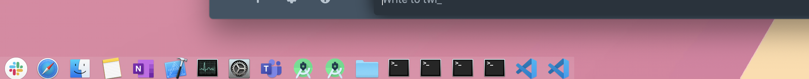

A proof-of-concept OSX Dock alternative or completentary utility written in Swift

### What

- small panel with open application icons
- positioned at the bottom of the screen just like Dock (I suggest to autohide the Dock or to move it to a side)
- always on top (above other windows)
- resizable
- visible on all spaces
- fast and low overhead

### Usage

- click on an application icon: show/hide application (icon dims)
- double click on an icon: show application and hide all others

### Why: It's difficult to explain it properly, but

- I use many apps at once and find it hard to keep my desktop tidy and myself focused
- I am ok with switching tasks frequently as long as it does not take too much effort to make the computer switch with me
- Spaces, MissionControl, FullScreenApplication usually involve slow animations and cognitive overload
- Dock and Cmd-Tab are good for a small number of apps

--

Feel free to try this, make suggestions, submit pull requests.

My next poc will focus on windows and window group management instead of just applications.
